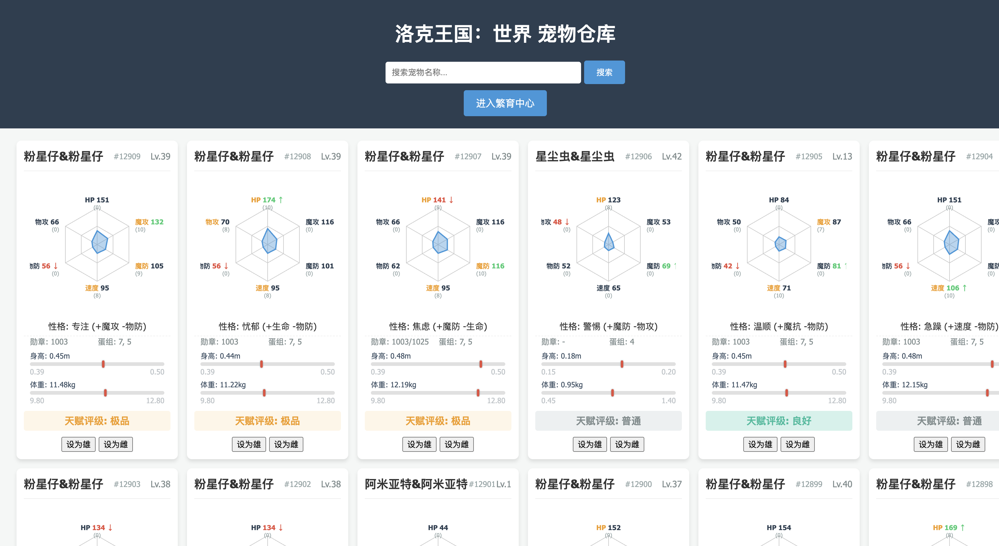
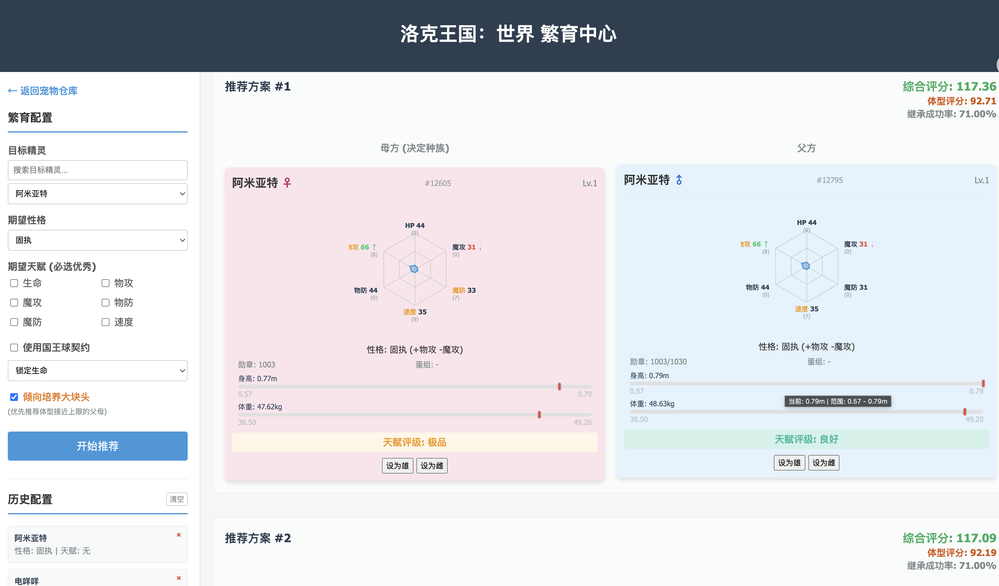

# 洛克王国手游繁育仓库 (Roco Kingdom World Pet Warehouse)


这是一个为《洛克王国》手游玩家设计的**自动化宠物繁育辅助系统**。

本项目的初衷是帮助“小洛克”们更高效地培育出“完美蛋”。通过自动化技术，系统能从庞大的个人仓库中快速筛选并匹配同蛋组的优质精灵，从而将玩家从枯燥的手工对比中彻底解放出来。当然，除了算法的助力，最快的繁育捷径依然是社区伙伴们之间对“完美蛋”的互助与分享。

## 🌟 核心功能

- **自动化同步**：通过 API 自动拉取个人仓库中的宠物数据（性格、天赋、血脉、身高等）。
- **智能繁育推荐**：
  - 基于游戏遗传算法计算目标天赋的继承概率。
  - 支持**大块头（体型）**倾向筛选。
  - 支持**指定性格**继承概率加成计算。
  - 自动匹配相同蛋组（Egg Group）的父方与母方。
- **数据可视化**：提供前端 Web 界面，直观查看宠物库和推荐结果。
- **本地化存储**：使用 SQLite 存储数据，支持历史记录和离线分析。

## 📸 界面预览 (Screenshots)

| 个人仓库同步 | 繁育推荐中心 |
| :---: | :---: |
|  |  |

## 🛠️ 技术栈

- **后端**: Python 3.10+, FastAPI, SQLite
- **前端**: Vanilla JS, HTML5, CSS3 (无需复杂框架，极速加载)
- **脚本工具**: Requests (用于数据采集)

## 🚀 快速开始

### 1. 克隆项目
```bash
git clone https://github.com/your-username/roco-kingdom-world-pet-warehouse.git
cd roco-kingdom-world-pet-warehouse
```

### 2. 环境配置
本项目推荐使用 `uv` 或 `venv`：
```bash
# 安装依赖
pip install -r requirements.txt
```

创建 `.env` 文件并填入你的认证信息（**切勿泄露给他人**）：
```env
X_MCUBE_ACT_ID=E80EH8LJ
AUTHORIZATION_TOKEN=你的Token
OPENID=你的OpenID
ACCESS_TOKEN=你的AccessToken
REFRESH_TOKEN=你的RefreshToken
```

### 3. 同步数据
运行同步脚本，将游戏内宠物数据同步至本地数据库：
```bash
python scripts/fetcher.py
```

### 4. 启动服务
启动 FastAPI 后端服务器：
```bash
# 运行后端
python backend/main.py
```
访问 [http://localhost:8000](http://localhost:8000) 即可开始使用繁育计算器。

## 📂 项目结构

- `backend/`: 核心逻辑与 API 服务。
- `frontend/`: 网页前端代码。
- `scripts/`: 数据抓取与同步工具。
- `docs/`: 存放静态配置 JSON（蛋组、宠物基础信息等）。

## 🙏 鸣谢 (Acknowledgments)

本项目的实现离不开以下开源项目和社区资源的启发与支持，在此表示诚挚的感谢：

- [P0pola/Roco-Kingdom-World-Data](https://github.com/P0pola/Roco-Kingdom-World-Data) - 提供了宝贵的游戏数据参考。
- [yuzeis/Roco-Kingdom-Protocol-Parser](https://github.com/yuzeis/Roco-Kingdom-Protocol-Parser) - 提供了协议解析思路，对数据同步功能大有裨益。
- [洛克王国孵蛋概率计算器 V2.8.1 (ya-xinghe.github.io)](https://ya-xinghe.github.io/-/) - 提供了优秀的算法与交互参考。

## 🛡️ 使用边界 (Usage Boundaries)

本项目仅面向学习、研究、教学示例、互操作性研究与安全研究。
作者不支持且不鼓励将本项目用于开发外挂、破坏游戏公平环境或其他违反游戏服务协议及法律法规的用途。

## ⚠️ 免责声明

1. 本项目仅供学习和研究使用，不代表官方立场。
2. **技术原理说明**：本项目通过合法的小程序公开接口获取数据，**未以任何方式修改、入侵或干扰游戏本体数据及运行逻辑**。理论上不违反游戏核心公平性规则。
3. 使用本项目产生的任何后果（如账号异常、接口封禁等）由使用者自行承担。
4. 请遵守相关法律法规，不得利用本项目进行任何违法违规操作。
5. **安全提示**：请务必妥善保管你的 Token，不要将包含敏感信息的 `.env` 文件或抓包记录上传到任何公共平台。

## 📄 开源协议
[MIT License](LICENSE)
