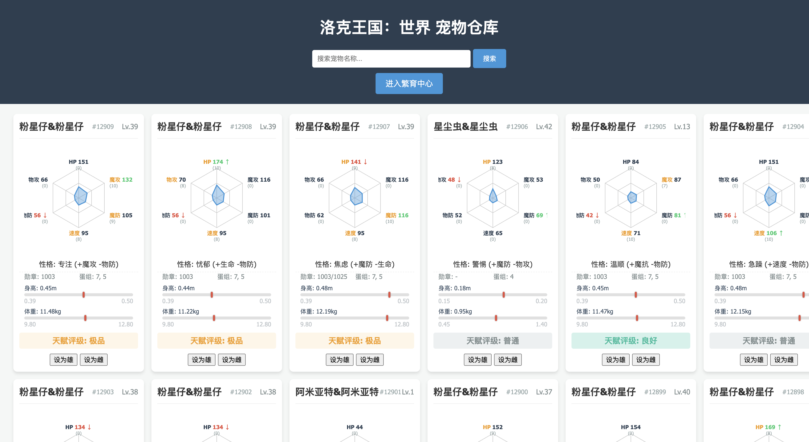
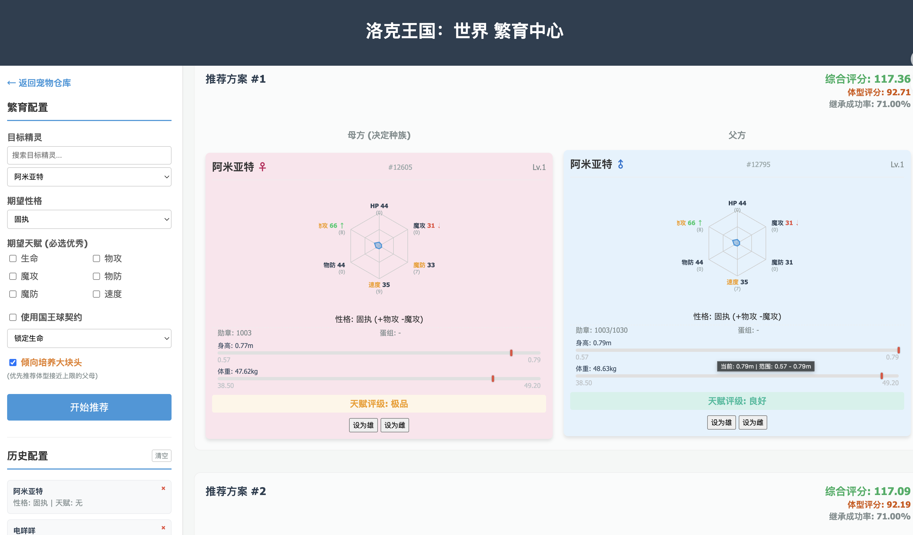

# 洛克王国：世界 宠物仓库


本地工具，用来看自己的精灵仓库、挑繁育父母、算放生建议。数据在本机 SQLite 里。

## 核心功能

- **仓库**：按盒子 6×5 查看，空格子留在原位。可标大世界队伍、隐藏异色/炫彩。
- **繁育**：按蛋组和遗传权重推荐父母，可偏向体型和指定性格。
- **放生**：按进化家族保留异色/炫彩、慈悲为怀、同乘、爱分享、疾行和评分靠前的个体。
- **抓包记录**：管理员身份下把本机游戏的 8195 连接改道到本地观察，解密后写入仓库。换盒、进化、孵蛋、捕捉会在当前会话里更新；登录盒子快照认不全时，不会清掉没看到的格子。
- **同步精灵**：用 `.env` 里的令牌走游戏 HTTP 接口。不写盒子位置。大世界队伍不会因为不在这份名单里被标成已放生。

## 📸 界面预览 (Screenshots)

| 个人仓库同步 | 繁育推荐中心 |
| :---: | :---: |
|  |  |

## 🛠️ 技术栈

- **后端**: Python 3.12+, FastAPI, SQLite
- **前端**: 原生 JS、HTML、CSS
- **依赖**: `uv`（`pyproject.toml` / `uv.lock`）

## 🚀 快速开始

### 1. 克隆项目
```bash
git clone https://github.com/AlbertLighter/roco-kingdom-world-pet-warehouse.git
cd roco-kingdom-world-pet-warehouse
git submodule update --init
```

### 2. 安装依赖
```bash
uv sync
```

抓包还需要可选依赖，并且进程要有管理员权限：

```bash
uv sync --extra capture
```

Windows 上可以直接运行项目根目录的 `start.bat`。它会申请管理员权限，再执行 `uv run python backend/main.py`。

### 3. 令牌（只给「同步精灵」用）

复制 `.env.example` 为 `.env`，填入自己的令牌。不要把 `.env` 提交出去。已经有 `warehouse.db` 时，打开网页不必配置令牌。

### 4. 启动
在项目根目录执行，静态页面才能找到 `frontend/`：

```bash
uv run python backend/main.py
```

浏览器打开 [http://localhost:8000](http://localhost:8000)。四个页面是仓库、繁育中心、放生推荐、抓包记录。

改了抓包、解密或前端代码后，需要重启这个进程。抓包记录要先点「改道记录」，再进入游戏。

### OCR 自动补全性别

启动本项目后，`roco-warehouse-ocr` 可以把识别到的六维和性别发送到
`POST /api/match_gender_by_stats`。接口只匹配 `is_active=1` 的精灵，并且仅在六维
`hp / adAttack / adDefense / apAttack / apDefense / speed` 全部相同、结果恰好一条、
该条 `gender=0` 时设置性别。无匹配、重复六维或已有性别都不会修改数据库。

## 📂 项目结构

- `backend/main.py`：HTTP 接口。
- `frontend/`：仓库、繁育、放生、抓包四个页面。
- `scripts/`：HTTP 同步、改道解密、盒子与队伍、放生点击、对照窗。
- `docs/`：字段、繁育和放生规则、接口说明。
- `roco_kingdom_world_conf/`：游戏配置子模块，只读。

## 🙏 鸣谢 (Acknowledgments)

本项目的实现离不开以下开源项目和社区资源的启发与支持，在此表示诚挚的感谢：

- [P0pola/Roco-Kingdom-World-Data](https://github.com/P0pola/Roco-Kingdom-World-Data) - 提供了宝贵的游戏数据参考。
- [yuzeis/Roco-Kingdom-Protocol-Parser](https://github.com/yuzeis/Roco-Kingdom-Protocol-Parser) - 提供了协议解析思路，对数据同步功能大有裨益。
- [洛克王国孵蛋概率计算器 V2.8.1 (ya-xinghe.github.io)](https://ya-xinghe.github.io/-/) - 提供了优秀的算法与交互参考。

## 🛡️ 使用边界 (Usage Boundaries)

本项目仅面向学习、研究、教学示例、互操作性研究与安全研究。
作者不支持且不鼓励将本项目用于开发外挂、破坏游戏公平环境或其他违反游戏服务协议及法律法规的用途。

## ⚠️ 免责声明

1. 本项目仅供学习和研究使用，不代表官方立场。
2. **技术原理说明**：令牌同步读取游戏 HTTP 接口。改道记录只在本机观察并原样转发 8195 连接，不改包、不发送放生请求。点击放生只点击本机游戏窗口。账号风险由使用者自己承担。
3. 使用本项目产生的任何后果（如账号异常、接口封禁等）由使用者自行承担。
4. 请遵守相关法律法规，不得利用本项目进行任何违法违规操作。
5. **安全提示**：请务必妥善保管你的 Token，不要将包含敏感信息的 `.env` 文件或抓包记录上传到任何公共平台。

## 📄 开源协议
[MIT License](LICENSE)
